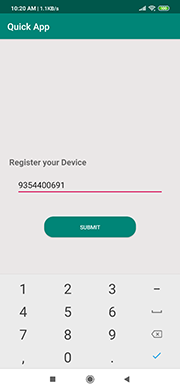
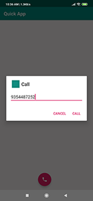
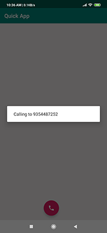
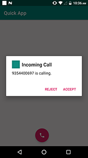
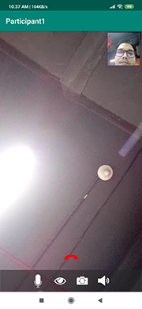

# EnableX Android Toolkit: App-to-App Calling with Firebase Integration Guide

Explore a robust demo framework for seamless app-to-app calling using the EnableX Android toolkit in conjunction with Firebase. 

This application showcases the capability to send push notification messages between two registered mobile numbers, enabling 1-to-1 calls upon receiving a push notification within the app. 

To effectively demonstrate this Android Sample App, a middleware server is crucial for mobile number registration and push notification delivery. In this context, we employ Firebase Cloud Messaging as the middleware server, which not only stores registered mobile numbers but also efficiently dispatches push notifications to the designated mobile devices. 

Discover the power of this integrated solution, designed to enhance your app-to-app communication experience. 

## 2. How to get started

### 2.1 Prerequisites

#### 2.1.1 App Id and App Key 

* Register with EnableX [https://www.enablex.io/free-trial/] 
* Login to the EnableX Portal
* Create your Application Key
* Get your App ID and App Key delivered to your email

#### 2.1.2 Test Application Server

You need to set up an Application Server to provision Web Service API for your Android Application to enable the Video Session. 

To help you try our Android Application quickly, without having to set up Application Server, the Application is shipped pre-configured with EnableX hosted Application Server i.e. https://demo.enablex.io. 

Our Application Server restricts a single Session durations to 10 minutes, and allows 1 moderator and not more than 3 participants in a Session.

Once you tried EnableX Android Sample Application, you may need to set up your own  Application Server and verify your Application to work with your Application Server.  Refer to point 3 for more details on this.

### 2.1.3 Configure and Build the app

Configure the sample app code with [firebase cloud messaging](https://firebase.google.com/docs/android/setup). Then, build and run the app.
1. The application requires **google-services.json**
2. The Application requires NodeJs Middleware server api for registering device with the mobile number and for send push notification to the device.
3. Push notification contains roomId and calling number.
4. The application **requires** values for **RoomId**.
	4.1 Replace the following empty strings with the corresponding **room_Id** values in `DashBoardActivity`:
```
private String room_Id = "";
```

* Open the App
* Go to WebConstants and change the following:
``` 
    /* To try the App with Enablex Hosted Service you need to set the kTry = true When you setup your own Application Service, set kTry = false */
        
        public  static  final  boolean kTry = true;
        
    /* Your Web Service Host URL. Keet the defined host when kTry = true */
    
        String kBaseURL = "https://demo.enablex.io/"
        
    /* Your Application Credential required to try with EnableX Hosted Service
        When you setup your own Application Service, remove these */
        
        String kAppId = ""  
        String kAppkey = ""  
 ```
 
 
 ## 3. Set up Your Own Application Server

 You may need to set up your own Application Server after you tried the Sample Application with EnableX hosted Server. We have differnt variants of Appliciation Server Sample Code. Pick one in your preferred language and follow instructions given in respective README.md file.

 * NodeJS: [https://github.com/EnableX/Video-Conferencing-Open-Source-Web-Application-Sample.git]<br/>
 * PHP: [https://github.com/EnableX/Group-Video-Call-Conferencing-Sample-Application-in-PHP]

 Note the following:

 * You need to use App ID and App Key to run this Service.
 * Your Android Client End Point needs to connect to this Service to create Virtual Room and Create Token to join session.
 * Application Server is created using EnableX Server API, a Rest API Service helps in provisioning, session access and post-session reporting.  

 To know more about Server API, go to:
 https://developer.enablex.io/docs/guides/video-guide/sample-codes/video-calling-app/#demo-application-server
 
 ## 4. Android Toolkit

 This Sample Application uses EnableX Android Toolkit to communicate with EnableX Servers to initiate and manage Real Time Communications. Please update   your Application with latest version of EnableX Android Toolkit as and when a new release is available.

 * Documentation: https://developer.enablex.io/docs/references/sdks/video-sdk/android-sdk/index/
 * Download: https://developer.enablex.io/docs/references/sdks/video-sdk/android-sdk/index/
 
## 5. Exploring the sample app

### 5.1 Register Device: 

This Application starts with registering the device with a Middleware server. Integrate firebase cloud messaging into an application. After FCM successfully registration, you will get an FCM token. After getting a token, the mobile number should be registered using node js API(Middleware Server). 



**Note:** An incoming native phone call will interrupt the current VoIP call.

### 5.2 Outgoing call
Caller call to registered mobile number by using push notification message. A message will be a JSON object which contains
{
	"message":"roomId",
	"receiver_phone_number":"9354401697",
	"caller_phone_number":"3238329829",
	"type":"calling"
}




### 5.3 Incoming call
The receiver will get an incoming call, as a push notification message which contains roomId and caller mobile number. The receiver will show the incoming call dialog if the type of message is **calling**.



### 5.4 Receive call
After joining a room by roomId, the Receiver sends a push notification message to the caller. And that message will be the JSON object which contains.
{
“message”:“answer”,
“receiver_phone_number”:“9354401697”,
“aller_phone_number”:“3238329829”,
“type”:“answer”
}

### 5.5 Reject call
If receiver rejects the incoming call then message will be sent to the caller through push notification that message will be JSON object which contains
{
	"message":"reject",
	"receiver_phone_number":"9354401697",
	"aller_phone_number":"3238329829",
	"type":"reject"
}




## Trial

1. Try a quick Video Call: https://demo.enablex.io/
2. Sign up for a free trial https://www.enablex.io/free-trial/
